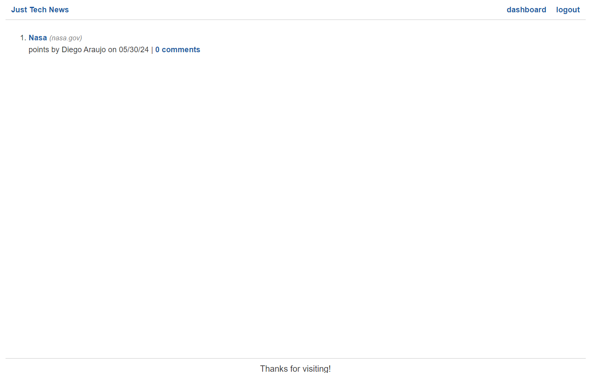

# Python Newsfeed

## Overview

**Python Newsfeed** is a web application built with Flask and SQLAlchemy, providing users with the ability to create, read, update, and delete posts. The application supports user authentication, post upvotes, and comment functionality.

## Table of Contents

- [Features](#features)
- [Technologies Used](#technologies-used)
- [Contributing](#contributing)
- [License](#license)
- [Contact](#contact)

## Features

- User Authentication (Signup, Login, Logout)
- Create, Read, Update, and Delete Posts
- Comment on Posts
- Upvote Posts
- User Dashboard
- Custom Jinja Filters
- Error Handling

## Technologies Used

- **Backend:**
  - Flask
  - SQLAlchemy
  - MySQL

- **Frontend:**
  - HTML
  - CSS
  - JavaScript

- **Others:**
  - Jinja2 for templating
  - bcrypt for password hashing
  - Flask-Login for session management

## Contributing

Contributions are welcome! Please follow these steps:

1. Fork the repository.
2. Create a new branch (`git checkout -b feature-branch`).
3. Make your changes.
4. Commit your changes (`git commit -m 'Add some feature'`).
5. Push to the branch (`git push origin feature-branch`).
6. Open a pull request.

## License

This project is licensed under the MIT License. See the [LICENSE](LICENSE) file for details.

## Contact

- **Author:** Diego Araujo
- **Email:** diegoaraujolive@hotmail.com

## Image

